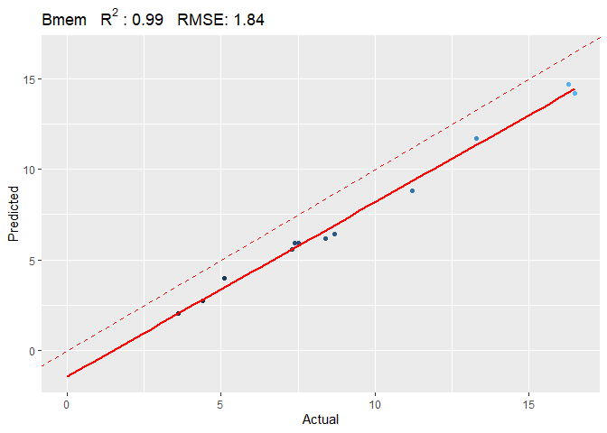

<!-- README.md is generated from README.Rmd. Please edit that file -->

# BloodCellDecon

<!-- badges: start -->
<!-- badges: end -->

The goal of BloodCellDecon is to …

## Installation

You can install the development version of BloodCellDecon from
[GitHub](https://github.com/) with:

``` r
# install.packages("devtools")
devtools::install_github("jingchen2/BloodCellDecon")
```

## Example

This is a basic example which shows you how to deconvolute test samples
in test.beta matrix:

``` r
library(BloodCellDecon)

test.res=estimateCellComposition(test.beta = test.beta, ref.beta.mat = ref.projection.EPIC$ref.beta.mat,projection = ref.projection.EPIC$projection, n.PC = 20,extended = F)
#> [1] "1800 probes found in test data."

plot_celltype(test.res*100,test.pd*100,celltype = 'Bmem')
#> `geom_smooth()` using formula = 'y ~ x'
```


    #> [[1]]
    #>    Predicted Actual celltype
    #> 1    2.72821    4.4     Bmem
    #> 2   14.68714   16.3     Bmem
    #> 3   14.20195   16.5     Bmem
    #> 4    3.96679    5.1     Bmem
    #> 5    5.55930    7.3     Bmem
    #> 6    8.82488   11.2     Bmem
    #> 7    2.06173    3.6     Bmem
    #> 8   11.68672   13.3     Bmem
    #> 9    5.90408    7.5     Bmem
    #> 10   6.17309    8.4     Bmem
    #> 11   6.40718    8.7     Bmem
    #> 12   5.92895    7.4     Bmem
    #> 
    #> [[2]]
    #> `geom_smooth()` using formula = 'y ~ x'


