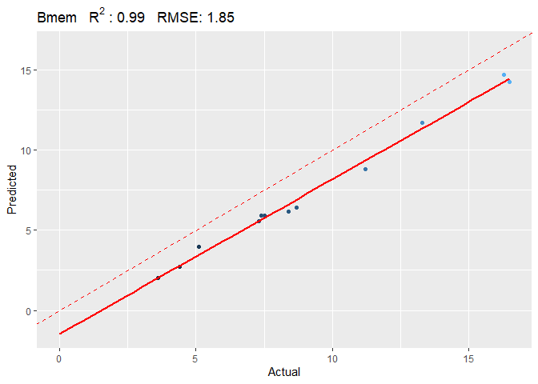

<!-- README.md is generated from README.Rmd. Please edit that file -->

# BloodCellDecon

<!-- badges: start -->
<!-- badges: end -->

BloodCellDecon deconvolutes cells based on blood DNA methylation arrays.

## Installation

Please make sure
[genefilter](https://bioconductor.org/packages/release/bioc/html/genefilter.html)
package is installed before installing BloodCellDecon. You can install
BloodCellDecon from [GitHub](https://github.com/) with:

``` r
# install.packages("devtools")
devtools::install_github("jingchen2/BloodCellDecon")
```

## Example

This is a basic example which shows you how to deconvolute test samples
in test.beta matrix. ref.projection.EPIC is the pre-computed data
containing the projection matrix and the mean reference beta matrix.

``` r
library(BloodCellDecon)

test.res=estimateCellComposition(test.beta = test.beta, ref.beta.mat = ref.projection.EPIC$ref.beta.mat,projection = ref.projection.EPIC$projection, n.PC = 20,extended = F)
#> [1] "1800 probes found in test data."

p=plot_celltype(test.res*100,test.pd*100,celltype = 'Bmem')
#> `geom_smooth()` using formula = 'y ~ x'
```


